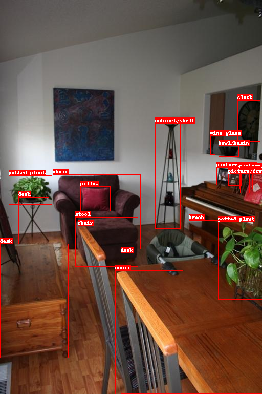

# tsv
[![Python][Python.js]][Python.link]
[![PyTorch][PyTorch.js]][PyTorch.link]

OFAでFinetuningするために、HICO-DETとV-COCOをtsvにします

pretrained_data_examples/ は
[OFA](https://github.com/OFA-Sys/OFA/) の 
[A small subset of the pretraining data](https://ofa-beijing.oss-cn-beijing.aliyuncs.com/datasets/pretrain_data/pretrain_data_examples.zip) をダウンロードしています

all_captions.txt は重いので消しました

## 結果例

tsvから読み込んだ画像とアノテーションの可視化

<!-- MARKDOWN LINKS & IMAGES -->
[Python.js]: https://img.shields.io/badge/Python-3572A5?style=for-the-badge&logo=Python&logoColor=white
[Python.link]: https://www.python.org/
[PyTorch.js]: https://img.shields.io/badge/PyTorch-e34c26?style=for-the-badge&logo=PyTorch&logoColor=white
[PyTorch.link]: https://www.pytorch.org/